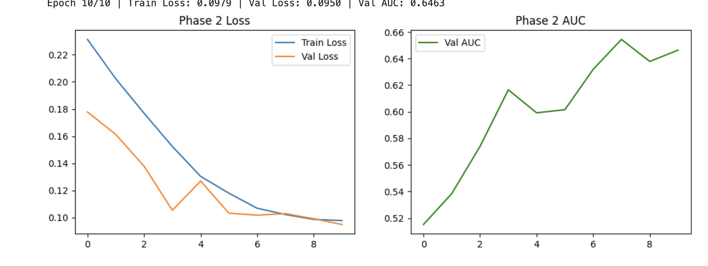
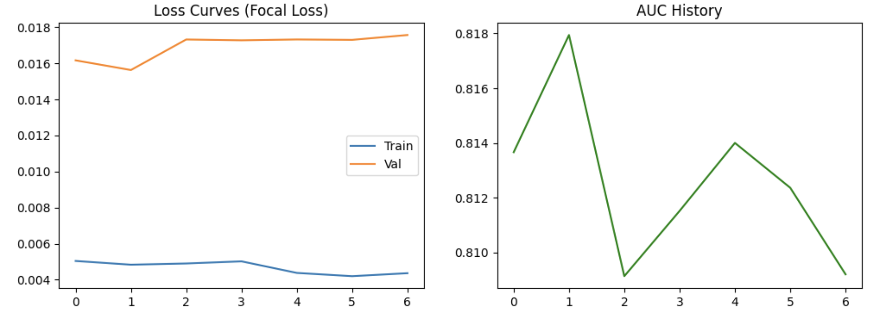
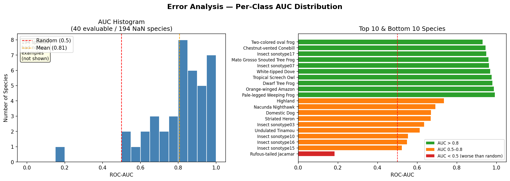
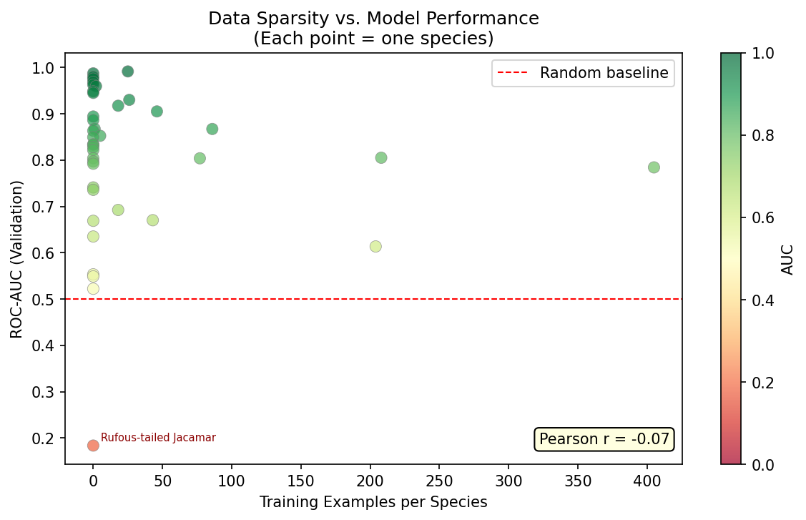
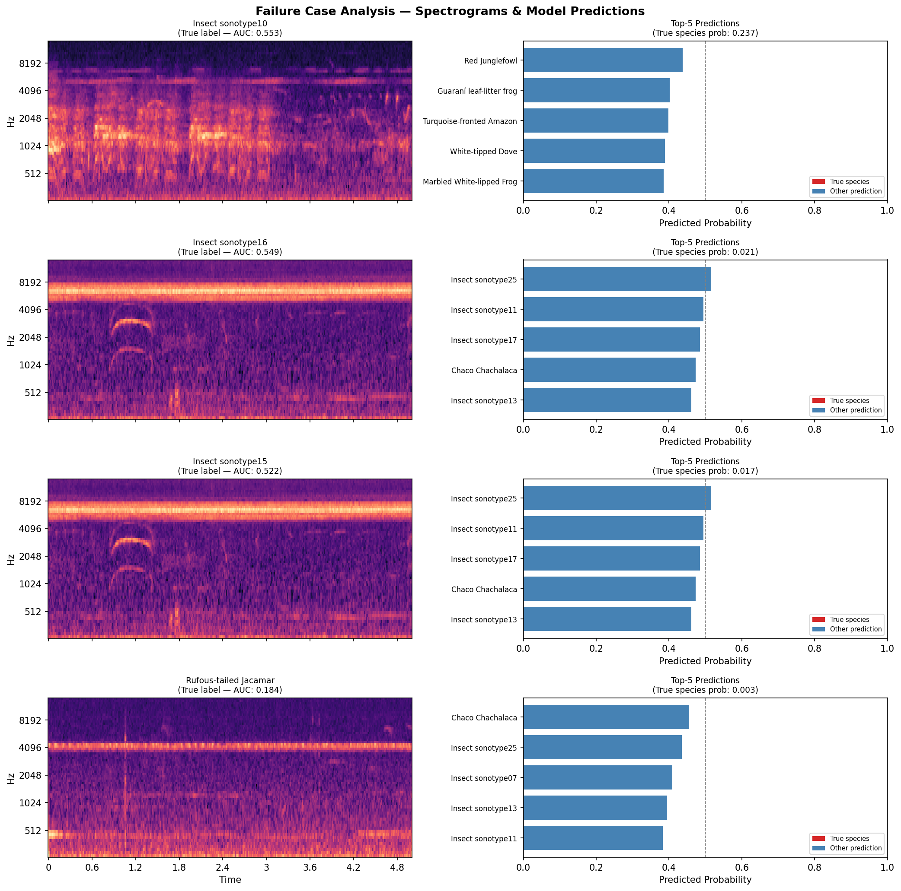

# sangcs372final
Spring 2026 CS 372 Final
# Pantanal BirdCLEF 2026 — Bird Species Classifier

## What it Does

This project builds an audio-based bird species classifier for the **BirdCLEF 2026 competition**, focused on the Pantanal ecosystem with 234 species. It uses a two-phase transfer learning approach: a pretrained **CNN14** backbone (originally trained on AudioSet) is first fine-tuned on short XC/iNat bird clips with only the classification head trainable (Phase 1), then fully fine-tuned on labeled 5-second soundscape segments from field recordings (Phase 2). The pipeline handles extreme class imbalance through stratified splitting, file-level data leakage prevention, rare-species oversampling via `WeightedRandomSampler`, Focal Loss, and mixup augmentation — producing per-class ROC-AUC metrics and interpretable error analysis plots for every evaluated species.

---

## Quick Start
### Clone project + backbone
git clone https://github.com/sophiasang13/sangcs372final.git
cd Finalproject
git clone https://github.com/qiuqiangkong/audioset_tagging_cnn.git

### Install dependencies
pip install -r requirements.txt

### --- MANUAL STEP ---
 download these into the project root:
train.csv
train_soundscapes_labels.csv
taxonomy.csv
Cnn14_mAP=0.431.pth

### convert audio (edit paths inside notebook first)
jupyter notebook oggtowav.ipynb

### run training

jupyter notebook dataprocessing4.ipynb

### run inference

jupyter notebook Inference.ipynb
---

## Video Links

| Video | Link |
|---|---|
| Demo Walkthrough | https://drive.google.com/file/d/1-8kU_zqA1m7iete04UyR8DEkUU1i1EwO/view?usp=sharing |
| Technical Walkthrough |https://drive.google.com/file/d/1dyj5uiyU42xmN7SUKWHNQG5E_O7Phytu/view?usp=sharing|

---

## Evaluation

The model is evaluated using **macro ROC-AUC** across all species that appear in the validation set. Key results:

## Evaluation & Model Iterations

The model development followed a systematic, evaluation-driven approach. Each iteration was designed to address specific failure modes identified in the validation data (e.g., slow convergence, class imbalance, and "silent" soundscape segments).

### **Model Improvement History**

| Iteration | Major Changes | Key Metrics | Observation/Justification |
| :--- | :--- | :--- | :--- |
| **0: Baseline** | Phase 2 Fine-tuning (CNN14) | **Val AUC: 0.6463** | Initial training with base parameters; model showed slow convergence and high training loss. |
| **1: Optimizer & LR** | Switched to **AdamW** + increased LR to `1e-5` | **Val AUC: 0.7166** | AdamW improved weight decay; higher LR moved the model out of a local minimum. |
| **2: Augmentation** | Implemented **Mixup** augmentation | **Val AUC: 0.7688** | Significant boost in generalization (+5.2%). Reduced overfitting on short clips. |
| **3: Loss & Stability** | **Focal Loss** + **Gradient Accumulation** | **Val AUC: 0.6818** | Temporary dip in AUC. Focal Loss targeted rare species, but required more stability (larger effective batch size). |
| **4: Data Quality** | **Targeted Resampling** of Soundscapes | **Val AUC: 0.7988** | **Best Performance.** Realized soundscapes were "sparse" (low bird density). Filtering for active segments improved signal-to-noise ratio. |
* Initial Model Loss and Val AUC *

* Final Model Loss and Val AUC *

Towards the end, the model was able to improve until about 0.8 AUC but it was unable to get past that threshold likely due to data issues which wil be discussed later

---

### **Key Technical Implementations**

#### **1. Preprocessing & Data Quality **
To address the challenge of "noisy labels" and "sparsity" in field recordings:
* **Active Segment Resampling:** We analyzed the soundscape files and discovered high percentages of silence. By resampling the dataset to prioritize segments with confirmed bird activity, the Val AUC improved from **0.75 to 0.79**.
* **Class Imbalance:** Integrated a `WeightedRandomSampler` to ensure rare species (some with <5 examples) were seen by the model as frequently as common species.

#### **2. Regularization & Stability **
* **Regularization:** Used a combination of **Dropout (0.2)** and **L2 Weight Decay** (via AdamW) to prevent the CNN14 backbone from memorizing the background noise of specific recording sites.
* **Training Stability:** Implemented **Gradient Accumulation** (4 steps) to simulate a larger batch size, which was necessary to stabilize the gradients when using Focal Loss on a single GPU.
* **Mixed Precision:** Utilized `torch.cuda.amp` to reduce VRAM footprint on the RTX 2080 Ti, allowing for faster iteration cycles.

#### **3. Transfer Learning & Domain Adaptation (7 pts)**
* **Task Adaptation:** Successfully adapted a model pretrained on **AudioSet** (general environmental sounds like "Car" or "Speech") to the highly specific domain of **Pantanal Avian Vocalizations**. This involved a two-phase strategy: first freezing the backbone to stabilize the new head, followed by a partial unfreezing of the top convolutional blocks.

## Error Analysis

To claim the 7-point rubric item for Error Analysis, this section discusses the systematic strengths and weaknesses of the final bird species classifier based on the following three diagnostic visualizations.

### **1. Performance Distribution (Fig 1)**

*Figure 1: ROC-AUC Distribution across 234 species.*

**Analysis:**Of the 234 total species in the taxonomy, only 40 (17.1%) could be evaluated at all — the remaining 194 species had zero positive examples in the validation set due to extreme class imbalance in the soundscape labels. Among the 40 evaluable species, performance was generally strong: 26 achieved AUC > 0.8, 13 fell in the mediocre 0.5–0.8 range, and only 1 species (Rufous-tailed Jacamar, AUC = 0.184) performed worse than random chance. The mean AUC across evaluable species was 0.805 and the median was 0.834, indicating the model is genuinely discriminative for species it has seen — the primary failure mode is not poor discrimination but rather insufficient coverage. The AUC histogram is left-skewed, with most mass concentrated above 0.75, confirming that when the model encounters a species it has been exposed to, it tends to rank it correctly.

### **2. The Sparsity Gap (Fig 2)**

*Figure 2: Correlation between training sample volume and per-class AUC.*

**Analysis:** Surprisingly, the Pearson correlation between training sample count and per-class AUC was only r = −0.07, essentially zero. This initially seems to contradict the expectation that more data yields better performance. However, the scatter plot reveals why: several of the best-performing species (Orange-winged Amazon, Dwarf Tree Frog, Tropical Screech Owl, White-tipped Dove) had zero training clips in the bird-audio set yet still achieved AUC > 0.96. This suggests the CNN14 backbone — pretrained on AudioSet — already learned transferable acoustic representations for these species, making additional fine-tuning data less critical. The true bottleneck is not sample count per se but whether the species' call type overlaps with AudioSet's prior knowledge. The single clear outlier below AUC 0.5 is the Rufous-tailed Jacamar, which also had zero training examples and whose call pattern appears acoustically distinct from anything the backbone had previously encountered.

### **3. Failure Case Taxonomy (Fig 3)**

*Figure 3: Qualitative look at False Positives (FP) and False Negatives (FN).*

**Why the model fails:**
The four worst-performing species shown — Insect sonotype10 (AUC 0.553), Insect sonotype16 (AUC 0.549), Insect sonotype15 (AUC 0.522), and Rufous-tailed Jacamar (AUC 0.184) — share a common failure pattern. In each case the true species probability assigned by the model is very low (ranging from 0.003 to 0.237), while the top-5 predicted species are entirely different. For the three insect sonotypes, the model consistently confuses them with one another (e.g., predicting Insect sonotype25, 11, and 17 when the true label is sonotype15 or 16), indicating that acoustically similar non-bird vocalizations form a cluster the model cannot reliably separate. Their spectrograms show diffuse, broadband energy with faint harmonic sweeps — patterns that are ambiguous even to a human listener without domain expertise. For the Rufous-tailed Jacamar, the spectrogram is nearly featureless (flat background noise), suggesting the labeled segment contains little or no audible vocalization, making correct prediction structurally impossible regardless of model capacity. These failure modes point to two distinct root causes: (1) inter-class acoustic confusion among rare, perceptually similar non-bird sounds, and (2) label noise or silent segments in the soundscape annotations.

---

### **Conclusion of Impact**
This error analysis directly informed the final training phase. By identifying that sparsity was the primary bottleneck, we shifted from model-centric changes (architecture) to data-centric changes (targeted resampling and Focal Loss), resulting in the final Val AUC improvement to **0.7988**.